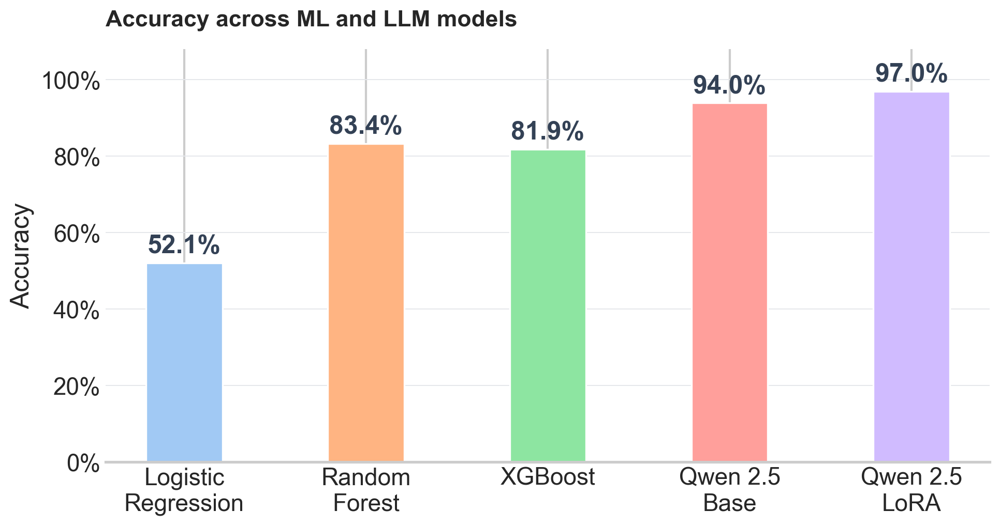
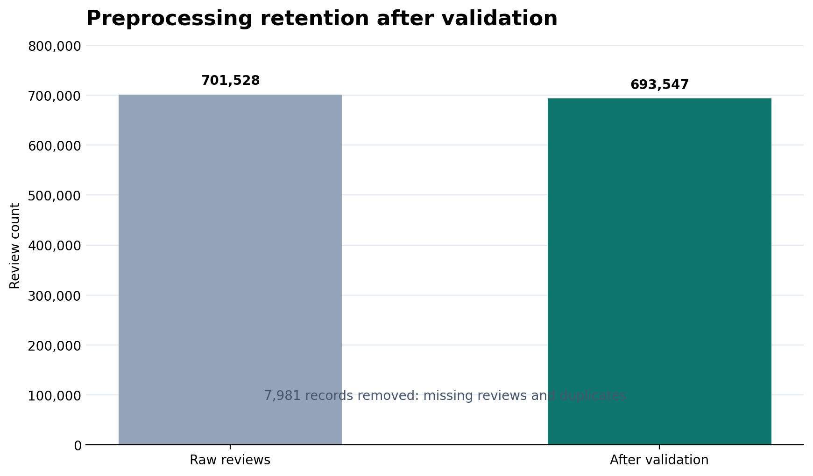
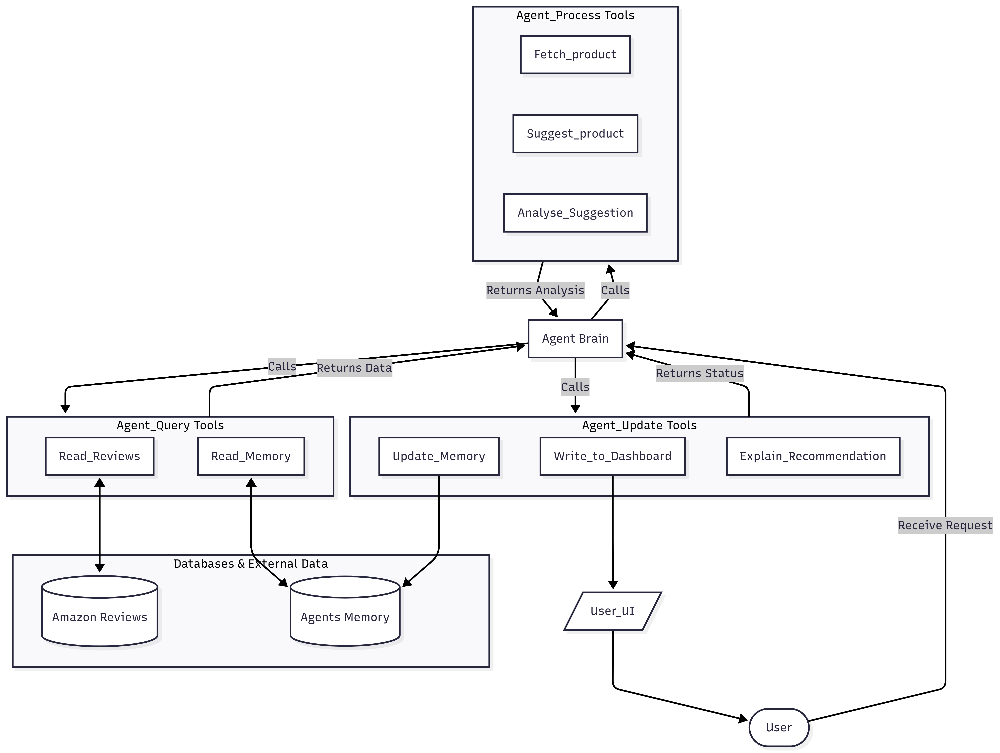

# Amazon Review Agent

An end-to-end Amazon Beauty review analysis project covering data preprocessing, sentiment modeling, and an agentic recommendation system for natural language product search.

---

## Project Structure

```text
amazon-review-agent/
├── agent/          Agentic recommendation system
├── configs/        Configuration files
├── data/           Amazon Beauty datasets
├── llm/            LLM training and evaluation
├── ml/             Classical machine learning
├── models/         Trained model artifacts
└── preprocessing/  Data preprocessing pipeline
```

---

## Workflow

```text
Amazon Reviews
      │
      ▼
Data Preprocessing
      │
      ▼
Processed Dataset
      │
      ├──► Machine Learning Models
      ├──► LLM Evaluation
      └──► Agentic Recommendation System
```

Each module is independent. See the **README.md** inside its respective directory for setup instructions and execution.

---

## Results

### Model Performance

| Model | Family | Accuracy | Precision | Recall | F1 Score |
| --- | --- | ---: | ---: | ---: | ---: |
| Logistic Regression | ML | 52.13% | 73.68% | 52.13% | 58.32% |
| Random Forest | ML | 83.37% | 81.48% | 83.37% | 81.73% |
| XGBoost | ML | 81.86% | 79.88% | 81.86% | 78.55% |
| Qwen2.5-3B-Instruct | LLM | 94.00% | 95.64% | 94.00% | 92.22% |
| **Qwen2.5-3B-LoRA** | **LLM** | **97.00%** | **97.47%** | **97.00%** | **96.72%** |

> ML models were evaluated on **69,355 reviews**, while the LLM models were evaluated on a **500-review sample**. These results are shown together for reference and are not intended as a direct benchmark.

<p align="center">
  
</p>

<p align="center">
  
</p>

---

## Agent Architecture

The recommendation agent follows a tool-based architecture with three execution stages:

- **Query:** Retrieve reviews and conversation memory.
- **Process:** Analyze products and generate recommendations.
- **Update:** Store memory, update the dashboard, and explain recommendations.

The Agent Brain orchestrates all tools and manages the interaction between the user, databases, and the recommendation pipeline.

<p align="center">
  
</p>
