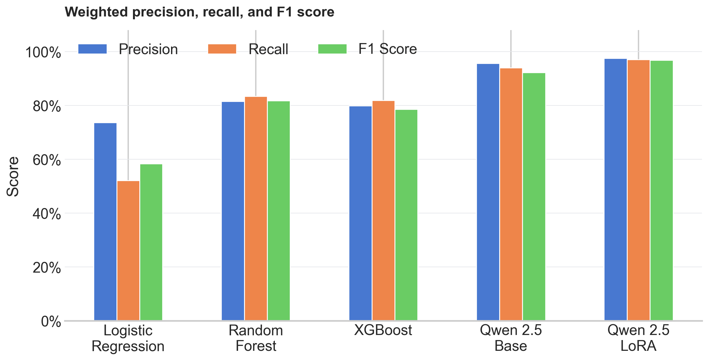

# LLM

This directory contains Qwen-based sentiment classification with both the base instruction model and a QLoRA fine-tuned adapter.

## Files

| File | Description |
| --- | --- |
| `prompt_builder.py` | Builds review prompts for three-class sentiment prediction. |
| `base_model.py` | Loads the quantized Qwen2.5-3B-Instruct model. |
| `lora_model.py` | Loads Qwen with the trained LoRA adapter. |
| `train_lora.py` | Fine-tunes Qwen with QLoRA(on 500 samples) |
| `evaluate.py` | Evaluates the base and LoRA models. |

## Results

Both LLMs were evaluated on the same 100-review test sample.

| Model | Accuracy | Precision | Recall | F1 score |
| --- | ---: | ---: | ---: | ---: |
| Qwen2.5-3B-Instruct | 94.00% | 95.64% | 94.00% | 92.22% |
| Qwen2.5-3B-LoRA | **97.00%** | **97.47%** | **97.00%** | **96.72%** |



LoRA improved accuracy by 3 percentage points and F1 score by 4.50 percentage points over the base Qwen model on the recorded sample.

## Sentiment Labels

```text
0 = Negative
1 = Neutral
2 = Positive
```

## Commands

```bash
python -m llm.train_lora
python -m llm.evaluate
```

Training uses `configs/lora_config.py` and saves the adapter under `models/`.
