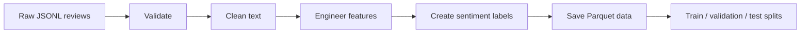

# Preprocessing

This directory prepares the Amazon Reviews 2023 All Beauty dataset for training and agent use.

## Files

| File | Description |
| --- | --- |
| `dataset_loader.py` | Loads and previews JSONL review data. |
| `validator.py` | Removes missing, invalid, and duplicate records. |
| `clean_reviews.py` | Normalizes review titles and text. |
| `feature_engineering.py` | Adds review-length and word-count features. |
| `sentiment_labels.py` | Converts ratings to sentiment labels. |
| `metadata_loader.py` | Builds the processed product catalog. |
| `splitter.py` | Creates train, validation, and test splits. |
| `pipeline.py` | Runs the preprocessing workflow. |

## Workflow



## Recorded Output

| Stage | Reviews |
| --- | ---: |
| Raw dataset | 701,528 |
| Missing reviews removed | 720 |
| Duplicate reviews removed | 7,261 |
| Final processed dataset | **693,547** |


The pipeline produced a 14-column processed dataset and saved it as `data/processed/All_Beauty.parquet`. Sentiment labels are derived from ratings: `< 3` negative, `3` neutral, and `> 3` positive.

## Command

```bash
python -m preprocessing.pipeline
```
